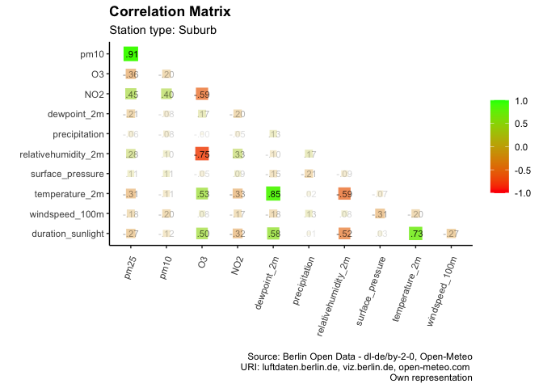
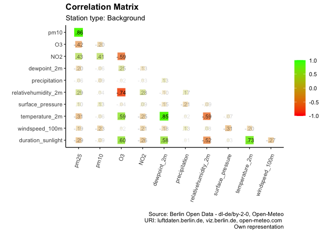
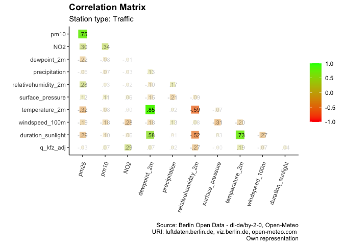

Explorative data analysis and pre-processing
================
Antoine Thomas
8/3/23

## Explorative data analysis

Exploratory data analysis involves examining the data sets imported as
part of the data collection process. The first step is to understand the
datasets and their variables, gain basic insights, and perform tasks
such as adjusting data types if necessary. Another step is to
investigate missing observations and how to deal with them. Finally, the
actual analysis begins with examining distributions by calculating
summary statistics and plots in the form of box plots, histograms, etc.
Temporal trends and anomalies as well as outliers can be identified.
Correlations, especially linear relationships between pollutant
concentrations and weather or traffic data, are then examined.

### Loading data sets from data collection

``` r
# Import of data sets which have been exported at the end of data collection
air_weather_df <- read_csv2(file = "Daten/DataCollection/air_weather_df.csv") %>%
  select(-...1)
traffic_df <- read_csv2(file = "Daten/DataCollection/traffic_df.csv") %>%
  select(-...1)
traffic_detectors <- read_csv2(file = "Daten/DataCollection/traffic_detectors.csv") %>%
  select(-...1)
airquality_stations <- read_csv2(file = "Daten/DataCollection/airquality_stations.csv") %>%
  select(-...1)

# Extracting stations and groups from airquality_stations
airquality_station_groups <- airquality_stations %>%
  select(name, stationgroups) %>%
  distinct()

# At a first sight, it appears that a lot of air quality monitoring data is 
# missing before the beginning of 2017. It is therefore decided to exclude 
# this data from the analysis
air_weather_df <- air_weather_df %>%
  filter(date >= as.Date("2017-01-01"))

# Grouping air quality monitoring data by station
airweather_by_station <- tibble(Station = airquality_station_groups %>% pull(name)) %>%
  mutate(messwerte = map(Station, function(x) air_weather_df %>% filter(Station == x)))
```

According to the data available to us, there are 20 air quality
monitoring stations in Berlin, evenly distributed throughout the city
and its immediate surroundings. These can be divided into 3 categories:
“Suburb”, “Background” and “Traffic”. “Suburb” stations are located in
the suburbs of Berlin, some of them in forests. “Background” includes
stations that are located in the city, but collect typical measurements
for residential areas. “Traffic” stations are located in the immediate
vicinity of a major road, and their readings are likely to be strongly
influenced by traffic.

### Observation and handling of missing values

``` r
# Function to compute the relative amount of missing values (NA) for each station and pollutant 
calc_na_amount <- function(st, df) {
  df %>%
    map(., ~((sum(is.na(.))/length(.))*100)) %>%
    as_tibble() %>%
    mutate(Station = st)
}

# Function to classify stations regarding the amount of missing data
classify_eliminate <- function(vec) {
  ifelse(sum(vec == T)>2, T, F)
}


# Computing the relative amount of NA's for eacht pollutant and Station.
# Providing information whether respective Station will be excluded or not. 
rel_na_amount_by_station <- airweather_by_station %>%
  mutate(na_amount = map2(Station, messwerte, calc_na_amount)) %>%
  pull(na_amount) %>%
  bind_rows() %>%
  select(Station,
         pm25,
         pm10,
         O3,
         NO2) %>%
  mutate(missing_pm25 = ifelse(.$pm25 > 25, T, F),
         missing_pm10 = ifelse(.$pm10 > 25, T, F),
         missing_O3 = ifelse(.$O3 > 25, T, F),
         missing_NO2 = ifelse(.$NO2 > 25, T, F)) %>%
  mutate(missing_agg = pmap(list(missing_pm25,missing_pm10,missing_O3,missing_NO2),c)) %>%
  mutate(eliminate = map(missing_agg, classify_eliminate),
         eliminate = as.logical(eliminate))


# Removing not needed functions
remove(calc_na_amount,
       classify_eliminate)


# Stations, providing nearly complete data
stations_values_complete <- rel_na_amount_by_station %>%
  filter(missing_pm25 == F,
         missing_pm10 == F,
         missing_O3 == F,
         missing_NO2 == F,
         eliminate == F) %>%
  pull(Station)

# Stations, which do not monitor O3 values
stations_O3_missing <- rel_na_amount_by_station %>%
  filter(missing_O3 == T,
         eliminate == F) %>%
  pull(Station)

# Stations, which do not monitor PM2.5/PM10 values
stations_PM_missing <- rel_na_amount_by_station %>%
  filter(missing_pm25 == T,
         missing_pm10 == T,
         eliminate == F) %>%
  pull(Station)


# Stations, their monitoring values as well as their missing values and type
airweather_by_used_stations <- tibble(Station = stations_values_complete, missing_values = NA) %>%
  rbind(tibble(Station = stations_O3_missing, missing_values = "O3")) %>%
  rbind(tibble(Station = stations_PM_missing, missing_values = "PM2.5/PM10")) %>%
  inner_join(airweather_by_station) %>%
  left_join(airquality_station_groups, by = c("Station" = "name"))

# Removing not needed data
remove(stations_values_complete,
       stations_O3_missing,
       stations_PM_missing)
```

It is noticeable that some stations provide very reliable data, while
others provide very unreliable or no data at all. In particular,
“traffic” type stations do not record data for O<sub>3</sub>. Some
“suburb” stations are also characterized by missing data for
PM<sub>2.5</sub> and PM<sub>10</sub>. For some other stations, up to
almost 70% of the values are missing over the period from January 2017
to May 2023. The decision to include stations in further analysis was
based on the proportion of missing data points for each pollutant. If a
station has more than 25% missing observations for more than two
pollutants, it is excluded from our dataset. The following table shows
the relative proportion of missing values and the decision to exclude or
not to exclude a station.

| Station                      |        pm25 |        pm10 |          O3 |        NO2 | eliminate |
|:-----------------------------|------------:|------------:|------------:|-----------:|:----------|
| 010 Wedding                  |   0.3437349 |   0.3437349 |   0.4887481 |  0.7053726 | FALSE     |
| 018 Schöneberg               | 100.0000000 | 100.0000000 | 100.0000000 |  0.3491058 | TRUE      |
| 027 Marienfelde              | 100.0000000 | 100.0000000 |   0.5048606 |  0.4976995 | FALSE     |
| 032 Grunewald                |   2.5368351 |   2.5332546 |   1.1529441 |  0.9524321 | FALSE     |
| 042 Neukölln                 |   0.6337612 |   0.6337612 |   0.4457812 |  0.6606155 | FALSE     |
| 077 Buch                     |   0.8002578 |   0.7966772 |   0.7984675 |  1.0688007 | FALSE     |
| 085 Friedrichshagen          |   0.8342732 |   0.8324829 |   0.8002578 |  0.7716132 | FALSE     |
| 115 Hardenbergplatz          | 100.0000000 | 100.0000000 |  62.3413359 |  0.7716132 | TRUE      |
| 117 Schildhornstraße         |   0.6516641 |   0.6534544 | 100.0000000 |  0.5675206 | FALSE     |
| 124 Mariendorfer Damm        |   0.3974435 |   0.3992338 | 100.0000000 |  0.2846555 | FALSE     |
| 143 Silbersteinstraße        |   0.2184149 |   0.2184149 | 100.0000000 |  0.4153463 | FALSE     |
| 145 Frohnau                  | 100.0000000 | 100.0000000 |   0.6212292 |  0.6391321 | FALSE     |
| 171 Mitte                    |   5.0915731 |   1.7168842 | 100.0000000 |  0.7393881 | FALSE     |
| 174 Frankfurter Allee        |   0.8020481 |   0.7948869 |  31.5555794 |  0.6427126 | FALSE     |
| 220 Karl-Marx-Straße         |  29.5039118 |  29.5021215 | 100.0000000 | 29.7420198 | TRUE      |
| 282 Karlshorst               | 100.0000000 | 100.0000000 | 100.0000000 |  0.3777503 | TRUE      |
| 088 Messwagen Leipziger Str. |  52.7937412 |  53.4257121 |  53.5134361 | 53.5044847 | TRUE      |
| 014 Sondermessstation        | 100.0000000 | 100.0000000 | 100.0000000 | 56.1147215 | TRUE      |
| 190 Leipziger Straße         |  50.8906672 |  50.8906672 | 100.0000000 | 50.8942478 | TRUE      |
| 221 Karl-Marx-Straße         |  69.6636053 |  69.6636053 | 100.0000000 | 70.9526111 | TRUE      |

The handling of missing data is unclear. Simply deleting all tuples with
missing values can result in a significant amount of data being lost.
Although for some pollutants there are longer periods where no
measurements are available, there are also very short periods of a few
hours in the datasets where the data probably could not be collected
correctly. Estimating data over a longer period of time is complicated
because measurements may vary irregularly over many consecutive hours or
days. In such a case, estimation with e.g. linear methods would run the
risk of estimating data that would later do more harm than good as
training data. However, over very short periods of time, the probability
of large fluctuations is greatly reduced. In such a situation, it would
be useful to estimate the missing data. Therefore, up to 4 consecutive
missing observations are estimated using interpolated values. In this
way, the proportion of missing observations can be reduced to a certain
extent without running the risk of neglecting large fluctuations in the
measured values.

``` r
# Function to approximate values by interpolation for given columns in a dataframe 
estimate_by_interpolation <- function(df, columns, maximum_gap) {
  for (col in columns) {
    # if a column has no values at all, do not interpolate
    if ((sum(is.na(df[[col]]))/length(df[[col]])) == 1) { 
      break
    }
    
    na_start <- min(which(!is.na(df[[col]]))) # index of first non NA value
    na_end <- max(which(!is.na(df[[col]]))) # index of last non NA value
    
    # approximate values between first and last NA value
    df[[col]][na_start:na_end] <- na.approx(
      df[[col]][na_start:na_end], maxgap = maximum_gap
      )
    
  }
  return(df)
}

# Replace missing values by Interpolation for all pollutants
airweather_by_used_stations <- airweather_by_used_stations %>%
  mutate(messwerte = map(.x = messwerte, estimate_by_interpolation, 
                         c("pm25", "pm10", "O3", "NO2"), 
                         4))
```

### Exploration of pollutant distributions and trends

To get a concrete insight into the air quality measurement data, the
first step is to look at their distributions. Particular attention is
paid to the mean and median values. For NO<sub>2</sub>, the mean value
for all stations considered is 22.1 μg/m<sup>3</sup>. PM<sub>10</sub>
follows with a mean of 19.9 μg/m<sup>3</sup>. O<sub>3</sub> is the most
concentrated pollutant with an average of 49.0 μg/m<sup>3</sup>. The
least concentrated is PM<sub>2.5</sub> with an average of 13.2
μg/m<sup>3</sup>. The mean for PM<sub>10</sub>, PM<sub>2.5</sub> and
O<sub>3</sub> is about 2 μg/m<sup>3</sup> above the median. For
NO<sub>2</sub>, the deviation is somewhat larger at more than 5
μg/m<sup>3</sup>. It is particularly noticeable that all pollutants show
extremely strong outliers. Especially PM<sub>10</sub> stands out with a
maximum value of 1501 μg/m<sup>3</sup>.

``` r
# Distribution of pollutant concentration by pollutant
airweather_by_used_stations %>%
  pull(messwerte) %>%
  bind_rows() %>%
  select(pm25, pm10, O3, NO2) %>%
  summary()
```

          pm25             pm10               O3              NO2       
     Min.   :  1.00   Min.   :   1.00   Min.   :  0.00   Min.   :  0.0  
     1st Qu.:  7.00   1st Qu.:  11.00   1st Qu.: 26.00   1st Qu.:  8.0  
     Median : 11.00   Median :  17.00   Median : 48.00   Median : 17.0  
     Mean   : 13.21   Mean   :  19.86   Mean   : 48.97   Mean   : 22.1  
     3rd Qu.: 17.00   3rd Qu.:  25.00   3rd Qu.: 68.00   3rd Qu.: 30.0  
     Max.   :587.00   Max.   :1501.00   Max.   :208.00   Max.   :220.0  
     NA's   :117979   NA's   :116080    NA's   :242942   NA's   :3406   

If the station types are considered separately, the influence of the
location and position of the stations on the measured values becomes
clear. For NO<sub>2</sub>, PM<sub>10</sub> and PM<sub>2.5</sub> it is
apparent that the values are lowest in suburban areas and highest by
roads. Only O<sub>3</sub> is higher in the suburbs than next to roads.
The urban background stations are on average between the other two
station types for all pollutants.


The differentiation between weekdays and weekends shows clear
differences in the mean pollutant concentrations for all station types.
For all pollutants except O<sub>3</sub>, higher values are found on
weekdays. O<sub>3</sub>, on the other hand, is measured with higher
values on weekends. The difference between the station types is the fact
that the differences between weekdays and weekend days are significantly
greater along roads and in the city than in suburban areas.


Looking at the average pollutant concentrations over the course of the
day, the above trends can be examined in more detail. It is noticeable
that for NO<sub>2</sub>, especially on weekdays, there is a strong
increase in concentration in the course of the morning. A similar but
much weaker increase can be observed in the late afternoon. As this
observation is mainly visible for the stations of the “traffic” type, it
can be assumed that these are emissions from rush-hour traffic. The fact
that these variations are not visible on weekends reinforces this
assumption. It can also be seen that the increase of NO2 in the morning
hours leads to a strong decrease of O<sub>3</sub> measurements. However,
this decrease is not visible in the afternoon. This phenomenon will be
examined in more detail below. For PM<sub>10</sub> and PM<sub>2.5</sub>,
an increase of the measured values in the morning is also observed on
weekdays, which decreases continuously during the day. On weekends,
there is no significant change in particulate matter levels.


When distinguishing between the seasons, clear differences can be seen,
especially for NO<sub>2</sub> and O<sub>3</sub>. While for
NO<sub>2</sub> significantly lower values are measured in spring and
summer than in winter and fall, the opposite effect can be observed for
O<sub>3</sub>. Here the values are generally higher in spring and summer
than in winter and fall. In the light of previous observations comparing
NO<sub>2</sub> and O<sub>3</sub>, a counteracting effect may be
suspected here. For PM<sub>10</sub> there is no real seasonal
difference. However, PM<sub>2.5</sub> values tend to be somewhat lower
in summer and spring than during winter and fall.


*Missing: Explanation Relation O3 and NO2*

### Combining pollutant concentration with traffic data

In order to identify correlations between traffic and air quality data,
these data were merged as part of the exploratory data analysis. To
ensure an appropriate relationship between the number of vehicles and
the pollutants emitted, the number of cars was added to the doubled
number of actual trucks. O<sub>3</sub> was not included in this case as
its evolution is not directly related to road traffic and the amount of
data for this pollutant is very limited. The following figure shows the
average development of the pollutants PM<sub>2.5</sub>, PM<sub>10</sub>
and NO<sub>2</sub> as well as the number of vehicles over the course of
a day at air quality monitoring stations of the category “traffic”. In
particular, there is a similarity between the evolution of
NO<sub>2</sub> and the number of vehicles. For PM<sub>2.5</sub> and
PM<sub>10</sub> there are no clear similarities. Only on weekdays does
it appear that there is a morning peak, as with the number of vehicles.
It is also noticeable that the highest points of the measured pollutant
concentrations are reached only 1-2 hours after the highest values of
the traffic volume. The traffic volume values (number of vehicles at
hour t of a day) are therefore adjusted to a moving average according
the following formula.

$$
n_{t_{adj}} = \frac{(n_t + n_{t-1} + n_{t-2})}{3}
$$


### Observation of strong outliers and unusual patterns

For a better understanding of the very high outliers, these have been
examined individually. The highest values for different pollutants are
shown in the following figures. Outliers were identified using the
inter-quartile range (IQR). First, the first and third quantiles (Q1/Q3)
are determined. From these the IQR can be calculated (IQR = Q3-Q1). The
so-called “normal data range” is defined in our case with a lower limit
of Q1-4\*IQR and an upper limit of Q3+4\*IQR. All data points that fall
below or exceed these limits are marked with dots in the figures.
Despite further investigation and attempts to explain high readings as
being due to particularly unusual weather events or exceptionally high
short-term traffic volumes, no precise reasons could be identified for
these strong outliers. It can therefore be speculated that they are due
to local factors not captured in our data, such as short-term
construction work, fires, malfunctioning monitoring stations, or even
deliberate falsification of readings by passers-by. Additionally,
extremely high levels of PM<sub>10</sub> and PM<sub>2.5</sub> are
measured every year on New Year’s Eve. These nights recorded the highest
PM<sub>2.5</sub> readings listed in our data set. These are caused by
the burning of fireworks in Berlin. It is noteworthy that due to the ban
on the sale of pyrotechnics and the cancellation of public fireworks due
to the corona pandemic on New Year’s Eve 2020/21 and 2021/22, elevated
levels have also been measured, but they are significantly lower than in
previous years.


### Observation of linear relationships and correlations

A correlation matrix makes it easy to identify linear relationships
between different variables. By combining air quality measurements,
weather data, and, in the case of “traffic” stations, additional traffic
data, general correlations can be seen. However, it quickly becomes
clear that there may be differences between groups of stations and
stations themselves. One station may be in the shade and protected from
sunlight. Another station may be well protected from the wind.
Therefore, depending on the individual conditions, the values may vary
from station to station. However, these are aspects that cannot be
explored in depth within the scope of this work. In the following, the
correlation matrices for the respective station types are examined. As
before, PM<sub>10</sub>, PM<sub>2.5</sub> and NO<sub>2</sub> are
positively correlated. O<sub>3</sub> is negatively correlated with all
other pollutants. In the context of meteorological data, O<sub>3</sub>
is positively correlated with daily sunshine duration, temperature and
dew point. O<sub>3</sub> is negatively correlated with humidity. For all
other pollutants, the same meteorological data show opposite linear
correlations. Only wind speed is negatively correlated with all
pollutants without exception. In addition, for the “traffic” stations, a
positive linear correlation between NO<sub>2</sub> and the number of
vehicles recorded hourly at respective stations can be determined.







## Pre-processing

As part of the pre-processing, the data should be prepared in such a way
that selected machine learning models achieve the best possible results.

Next Steps:

- Transforming values for better relationships

  - Moving average amount of cars

  - Sum of precipitation for the last i.e. 10 hours

  - Changing wind direction in degrees to factor values giving i.e. 8
    possible directions

- Removing strong outliers

etc…

### Session info

    R version 4.2.1 (2022-06-23)
    Platform: aarch64-apple-darwin20 (64-bit)
    Running under: macOS Ventura 13.3

    Matrix products: default
    BLAS:   /Library/Frameworks/R.framework/Versions/4.2-arm64/Resources/lib/libRblas.0.dylib
    LAPACK: /Library/Frameworks/R.framework/Versions/4.2-arm64/Resources/lib/libRlapack.dylib

    locale:
    [1] en_US.UTF-8/en_US.UTF-8/en_US.UTF-8/C/en_US.UTF-8/en_US.UTF-8

    attached base packages:
    [1] stats     graphics  grDevices utils     datasets  methods   base     

    other attached packages:
     [1] corrr_0.4.4     zoo_1.8-11      knitr_1.40      lubridate_1.8.0
     [5] forcats_0.5.2   stringr_1.4.1   dplyr_1.1.2     purrr_0.3.5    
     [9] readr_2.1.3     tidyr_1.2.1     tibble_3.2.1    ggplot2_3.4.0  
    [13] tidyverse_1.3.2

    loaded via a namespace (and not attached):
     [1] lattice_0.20-45     assertthat_0.2.1    digest_0.6.30      
     [4] utf8_1.2.2          R6_2.5.1            cellranger_1.1.0   
     [7] backports_1.4.1     reprex_2.0.2        evaluate_0.17      
    [10] highr_0.9           httr_1.4.4          pillar_1.9.0       
    [13] rlang_1.1.1         googlesheets4_1.0.1 readxl_1.4.1       
    [16] rstudioapi_0.14     rmarkdown_2.17      labeling_0.4.2     
    [19] googledrive_2.0.0   bit_4.0.4           munsell_0.5.0      
    [22] broom_1.0.1         compiler_4.2.1      modelr_0.1.9       
    [25] xfun_0.39           pkgconfig_2.0.3     htmltools_0.5.5    
    [28] tidyselect_1.2.0    fansi_1.0.3         crayon_1.5.2       
    [31] tzdb_0.3.0          dbplyr_2.2.1        withr_2.5.0        
    [34] grid_4.2.1          jsonlite_1.8.3      gtable_0.3.1       
    [37] lifecycle_1.0.3     DBI_1.1.3           magrittr_2.0.3     
    [40] scales_1.2.1        cli_3.6.1           stringi_1.7.8      
    [43] vroom_1.6.0         farver_2.1.1        fs_1.6.2           
    [46] xml2_1.3.3          ellipsis_0.3.2      generics_0.1.3     
    [49] vctrs_0.6.3         RColorBrewer_1.1-3  tools_4.2.1        
    [52] bit64_4.0.5         glue_1.6.2          hms_1.1.2          
    [55] parallel_4.2.1      fastmap_1.1.0       yaml_2.3.6         
    [58] colorspace_2.0-3    gargle_1.2.1        rvest_1.0.3        
    [61] haven_2.5.1        
